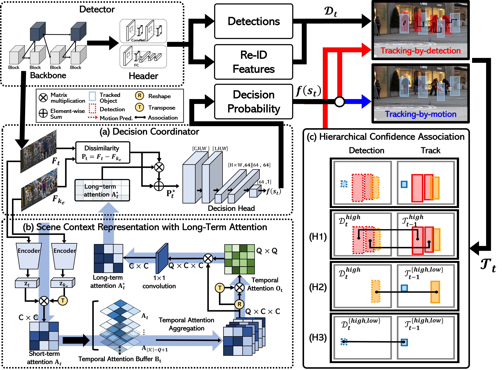

## Decode-MOT: How Can We Hurdle Frames to Go Beyond Tracking-by-Detection

A novel **decision coordinator for MOT (Decode-MOT)** which can determine the best tracking-by-detection or tracking-by-motion mechanism.
Decode-MOT mainly consists of **the decision coordinator, the scene and tracking contextual learning, and the hierarchical confidence association**.

## Abstract

The speed of tracking-by-detection (TBD) greatly depends on the number of running a detector because the detection is the most expensive operation in TBD. In many practical cases, multi-object tracking (MOT) can be, however, achieved based tracking-by-motion (TBM) only. This is a possible solution without much loss of MOT accuracy when the variations of object cardinality and motions are not much within consecutive frames. Therefore, the MOT problem can be transformed to find the best TBD and TBM mechanism.

To achieve it, we propose a novel decision coordinator for MOT (Decode-MOT) which can determine the best  TBD/TBM mechanism  according to scene and tracking contexts. In specific, our Decode-MOT learns tracking and scene contextual similarities between frames. Because the contextual similarities can vary significantly according to the used trackers and tracking scenes,  we learn the Decode-MOT via self-supervision. The evaluation results on MOT  challenge datasets prove that our method can boost the tracking speed greatly while keeping the state-of-the-art MOT accuracy.

### Highlights

* **Determining the best TBD or TBM mechanism :** Decode-MOT can determine the best TBD or TBM mechanism for real-time and high-accurate tracking. As a result, we can boost MOT speed while preserving MOT accuracy at most.
* **New contextual learning in order to measure scene and tracking contexts:** For learning the scene and tracking contexts, we propose a novel self-attention learning and define a new loss with the motion and cardinality similarities for TBD and TBM.
* **Self-supervised method:** Different from other MOT using self-supervision, we aims at improving the tracking speed as well as the model generalization.
* **Hierarchical confidence association method:** For robust Decode-MOT, we consider confidences of tracks and detections, and associate them hierarchically. 

## Main results

### Ablation Study
<table>
<thead>
	<tr>
		<th style="text-align:center">Name</th>
		<th style="text-align:center">TDR</th>
		<th style="text-align:center">MOTA</th>
		<th style="text-align:center">Hz</th>
	</tr>
</thead>
<tbody>
		<tr>
			<td rowspan=4 align="center">Baseline</td>
			<td align="center">100.0%</td>
			<td align="center">71.0%</td>
			<td align="center">21.4</td>
		</tr>
		<tr>
			<td align="center">80.0%</td>
			<td align="center">63.8%</td>
			<td align="center">26.9</td>
		</tr>
		<tr>
			<td align="center">75.0%</td>
			<td align="center">63.2%</td>
			<td align="center">29.2</td>
		</tr>
		<tr>
			<td align="center">66.6%</td>
			<td align="center">62.5%</td>
			<td align="center">32.1</td>
		</tr>
		<tr>
			<td rowspan=4 align="center">
			Decode-MOT  
			(Ours)
			</td>
			<td align="center">100.0%</td>
			<td align="center">73.4%</td>
			<td align="center">21.0</td>
		</tr>
		<tr>
			<td align="center">80.2%</td>
			<td align="center">70.6%</td>
			<td align="center">24.9</td>
		</tr>
		<tr>
			<td align="center">74.2%</td>
			<td align="center">70.3%</td>
			<td align="center">27.7</td>
		</tr>
		<tr>
			<td align="center">66.4%</td>
			<td align="center">69.1%</td>
			<td align="center">30.7</td>
		</tr>
</tbody>
</table>

 

### MOTChallenge test set
<table>
<thead>
	<tr>
		<th style="text-align:center">Method</th>
		<th style="text-align:center">Challenge</th>
		<th style="text-align:center">MOTA</th>
		<th style="text-align:center">Hz</th>
	</tr>
</thead>
<tbody>
	<tr>
		<td align="center" rowspan=3>Decode-MOT (Ours)</td>
		<td align="center" style="font-weight:bold">MOT16 test</td>
		<td align="center">74.7%</td>
		<td align="center">21.6</td>
	</tr>
	<tr>
		<td align="center" style="font-weight:bold">MOT17 test</td>
		<td align="center">73.2%</td>
		<td align="center">21.6</td>
	</tr>
	<tr>
		<td align="center" style="font-weight:bold">MOT20 test</td>
		<td align="center">67.2%</td>
		<td align="center">12.2</td>
	</tr>
</tbody>
</table>

* For MOTChallenge test, we use a single Titan Xp to run the Decode-MOT

## Qualitative Results

### Tracking Results

   

   

